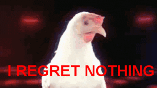

```{r setup, include=FALSE}
knitr::opts_chunk$set(echo = TRUE)
```

```{r echo=FALSE, message=FALSE}
# libraries

library(tidyverse)
```

## Diamonds project

Let's look at the Diamonds dataset that comes with ggplot

```{r data_in}
data(diamonds) #loads the data

head(diamonds) #let's look at the structure

```
We know that colour and clarity are important to how much diamonds cost but how about size? Let's calculate volumes from the x, y, z parameters, and then plot it against price, faceted by group

```{r size_price}

d_vols <- diamonds %>%
  mutate(vol_mm3=x*y*z)

ggplot(d_vols, aes(vol_mm3, price, colour=cut))+
  geom_point()+
  facet_wrap(~cut, scales="free")
```
Price does increase with volume but grade of diamond is not dependent on size.



